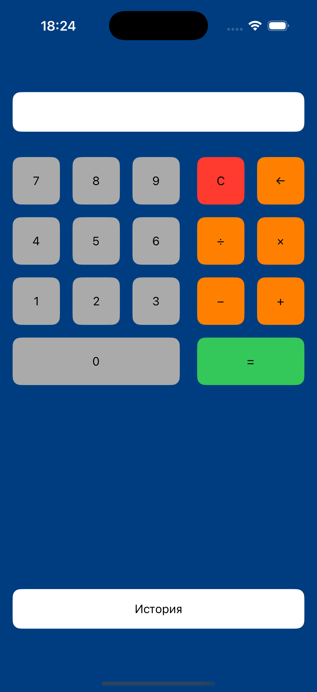
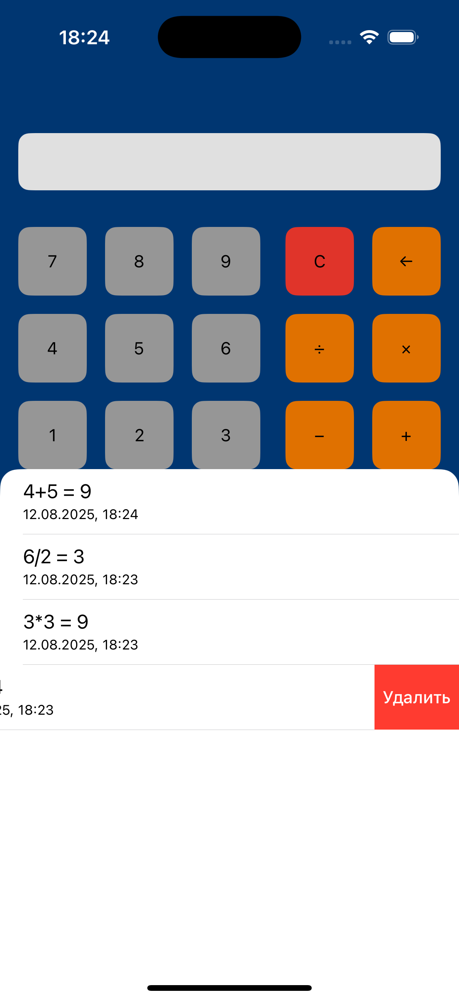

# Калькулятор на UIKit

Выполнено на языке Swift (iOS).

## 📷 Скриншоты

  
  

## 🚀 Установка

1. Клонируйте репозиторий:
   
git clone https://github.com/JLNap/calculatorMVP.git

2. Откройте проект в Xcode.

## ✨ Особенности

- Хранение результатов вычислений в CoreData
- Результаты вычислений показываются в sheet с использованием TableView в которой реализован свайпэкшн для удаления результата
- UIKit MVP

## 👤 Автор

Андрей Чучупал  
[Связаться](https://t.me/achuchupal)
